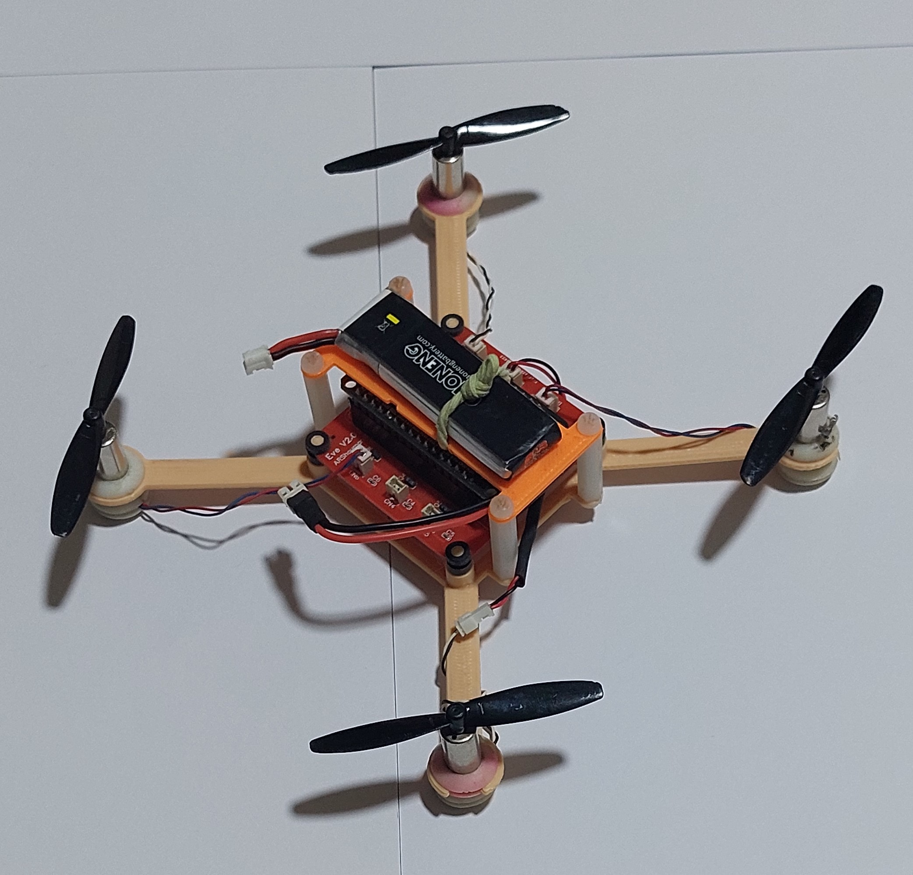
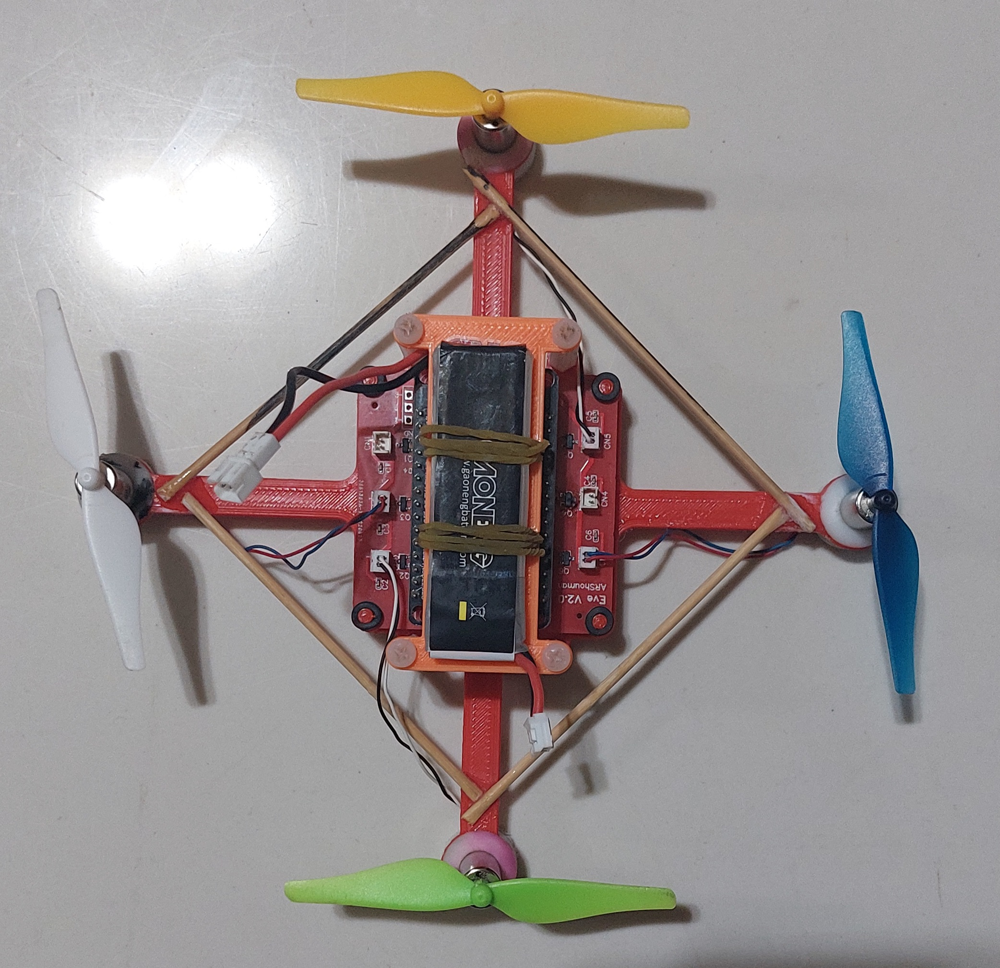
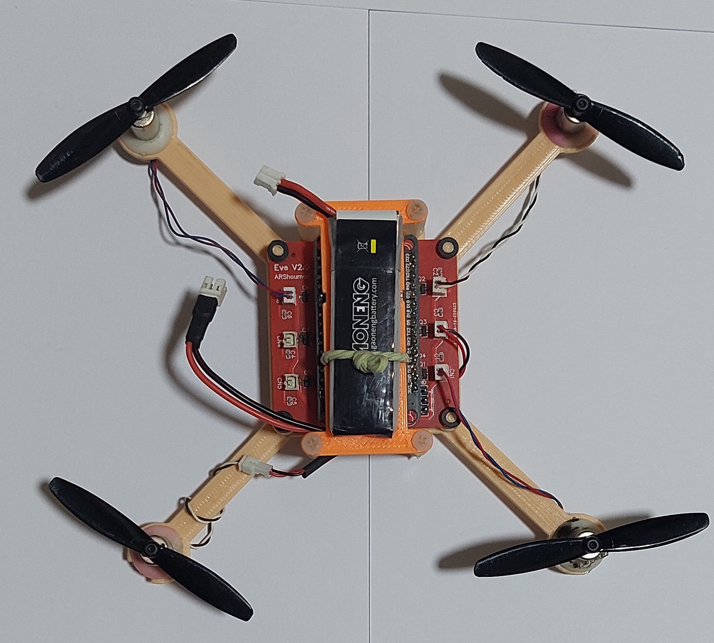
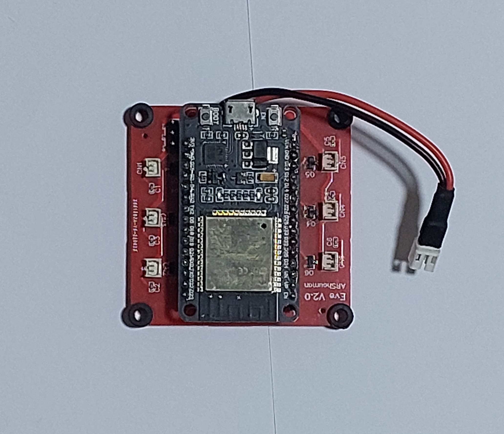
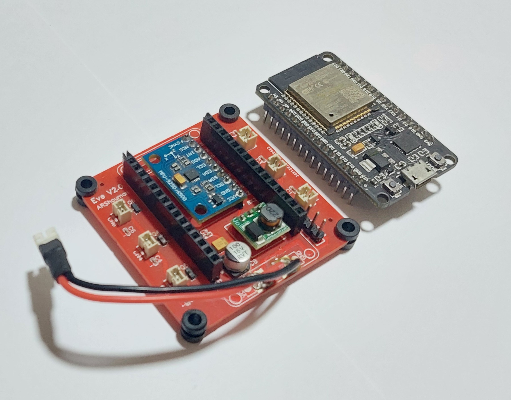
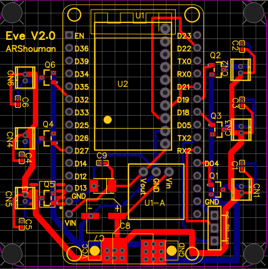

# ESP-Hover

## Table of Contents
1. [Overview](#overview)
2. [Motivation](#motivation)
3. [Design Details](#design-details)
   - [The Frame](#the-frame)
   - [The Flight Controller](#the-flight-controller)
   - [Motors and Propellers](#motors-and-propellers)
   - [Battery](#battery)
4. [Code Details](#code-details)
   - [The Drone Code](#the-drone-code)
   - [Drone Code Structure](#drone-code-structure)
   - [ROS Master Code](#ros-master-code)
5. [Libraries Used](#libraries-used)
6. [License](#license)

## Overview
ESP-Hover is a drone/quadcopter based on the ESP32 microcontroller. This drone is equipped with a 9-DOF IMU and can be controlled using an Android phone that supports BLE or ROS.

<p align="center" width="100%">
    
    <br>ESP-Hover
</p>

## Motivation
Learning about UAVs, aerial robotics, and understanding quadcopter dynamics has always been my passion. This project was a great opportunity to learn more about flight controllers and to build my own. Furthermore, this project was a chance to apply what I learned from the following courses:
1. Coursera Introduction to IoT Specialization
2. C++ Nanodegree from Udacity
3. Robotics Nanodegree from Udacity
4. Understanding PID Control by Brian Douglas

## Design Details

### The Frame
The frame is 3D printed and designed using SolidWorks. It consists of two main parts. The main part holds the flight controllers and the four motors, while the upper part holds the battery. The flight controller is designed to support two shapes of the frame: the X shape and the + shape.

<p align="center" width="100%">
    
    <br>ESP-Hover
   
    <br>ESP-Hover-2
</p>

<p align="center"  width="100%>
  <figure style="display: inline-block;">
    
    <figcaption>Plus Shape</figcaption>
  </figure>
  <figure style="display: inline-block;">
    
    <figcaption>X Shape</figcaption>
  </figure>
</p>

### The Flight Controller
To design this flight controller (FC), I had to learn about PCB design, circuit design, and electronic components. The FC board is a two-layer PCB and contains the basic elements necessary for the drone to fly. It includes the following elements:

- **ESP32 microcontroller**: I chose this microcontroller because it supports WiFi, classic Bluetooth, and BLE, providing various connection options. Additionally, it has two cores, allowing me to handle communication on one core and the flying PID loop on the other. The core logic handling is managed using FreeRTOS.
  
- **MPU9250**: This 9-DOF IMU contains a gyroscope, accelerometer, and magnetometer.

- **3.3V to 5V boost converter**: Used to power the ESP32 and the IMU.

- **6 Logic MOSFETs**: "IRLML2502" MOSFETs used to control the motor speeds.

- **Motor connectors and capacitors**: Essential for connecting and stabilizing the motors.

- **4 vibration dampers**: Protect the flight controller from motor vibrations.

<p align="center">
  <figure style="display: inline-block;">
    
    <figcaption>Flight Controller 1</figcaption>
  </figure>
  <figure style="display: inline-block;">
    
    <figcaption>Flight Controller 2</figcaption>
  </figure>
   <figure style="display: inline-block;;">
    
    <figcaption>PCB Design</figcaption>
  </figure>
</p>

### Motors and Propellers
The motors are 8x20mm brushless, and the propellers are 65mm in size. This combination provides a total thrust of 40 grams per motor, totalling 160 grams. The drone weighs 80 grams, resulting in a thrust-to-weight ratio of 2:1. This ratio could be improved by reducing the drone's weight.

### Battery
The battery capacity is 600mAh with a 50C discharge rate. This battery can provide a total of about 24 Amps, which is more than enough to power the motors and the flight controller.

## Code Details

### The Drone Code
I used Platform.io to write, test, and upload my code to the flight controller. The code is written in C++. The code structure is as follows:

```plaintext
[src]
├── CMakeLists.txt
├── FlightRecorder.cpp -> Sends flight data to the Android phone for processing.
├── IMUManager.cpp -> Reads data from the MPU9250 and utilizes sensor fusion algorithms to calculate the Pitch, Roll, and Yaw angles and corresponding rates.
├── Log.cpp -> Prints logs to the serial or ROS master.
├── MPU9250Wrapper.cpp -> Wrapper for the MPU9250 library.
├── PID.cpp -> Contains the PID controller logic.
├── ThrustManager.cpp -> Base class for the motor controllers.
├── PlusQuadThrustManager.cpp -> Handles motors thrust calculations for + shape motor configurations.
├── XQuadThrustManager.cpp -> Handles motors thrust calculations for X-shape motor configurations.
└── main.cpp -> The main class where all the magic happens.
```
The code has two versions. The first version is controlled using an Android phone that supports BLE (Bluetooth Low Energy). The Android application code can be found in this repository. The latest version allows the drone to be controlled using ROS and a joystick connected to the master computer. The ROS version was very helpful for tuning the PID controller with the help of ROS's plotting feature.

### Libraries Used
1. **MegunoLink**: Contains useful functions and helper classes such as ExponentialFilter.
2. **Rosserial Arduino Library**: Used to establish a connection with the ROS master.
3. **MPU9250**: Used to manage the MPU9250 IMU.

### Drone Code Structure

### ROS Master Code
Check this repository for the [ROS master source code](https://github.com/EngAhmed53/ESP-Hover-ROS-Master). 

## License
This project is licensed under the [MIT License](LICENSE).
